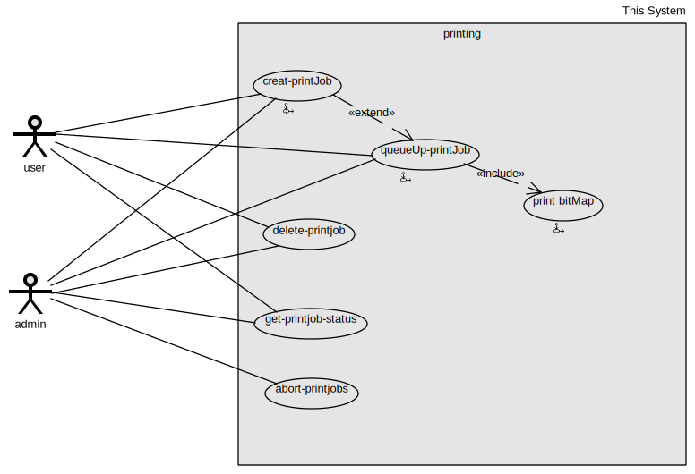
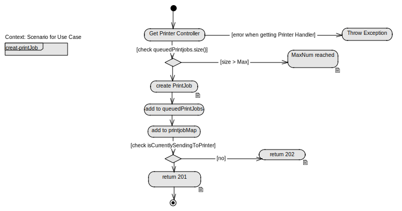
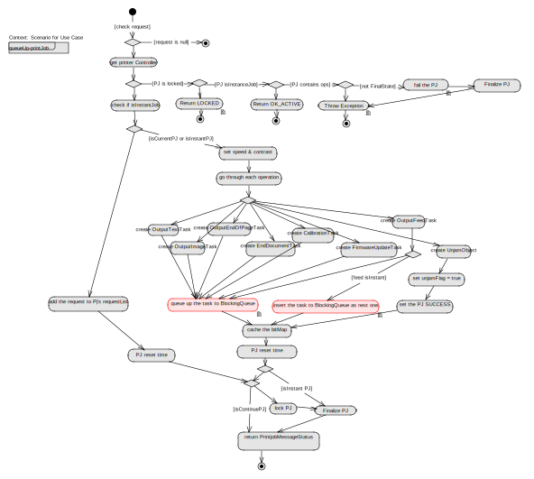
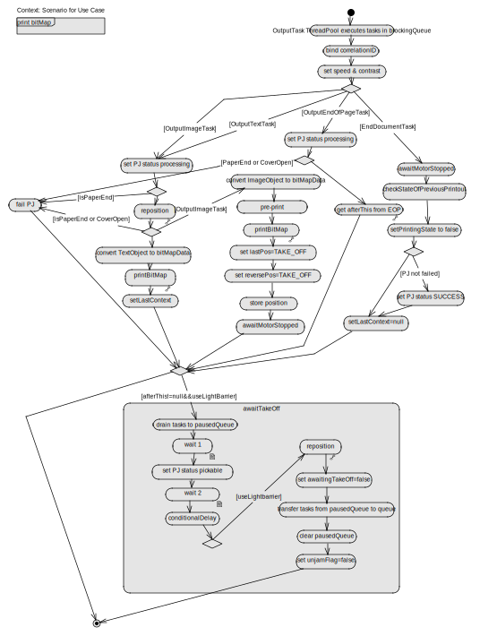
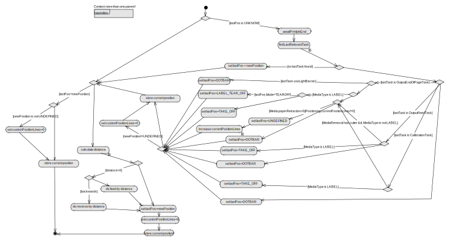
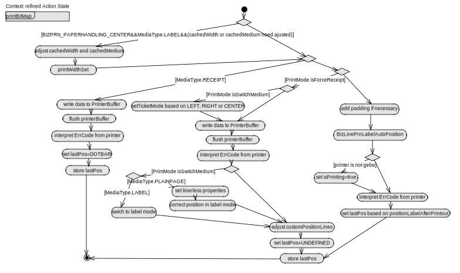
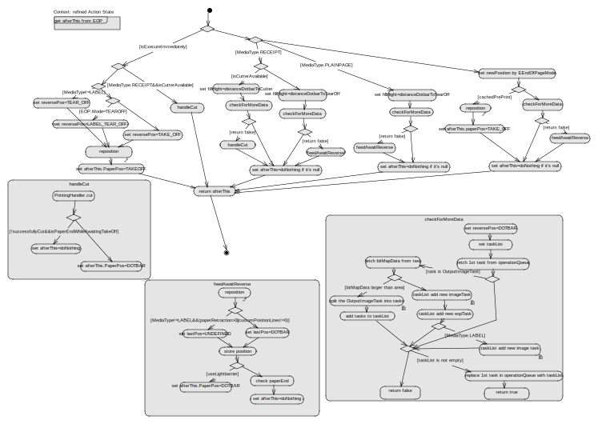

# Printing Diagrams Based on OpenAmeos 

## Steps for checking and modification

1. Download and install OpenAmeos from the website: https://www.scopeforge.de/cb/project/8?proj_id=8

2. Copy the folder "printing-bizlineprn" to OpenAmeos's path: ${OpenAmeos-RootPath}/Examples/

3. Open OpenAmeos, choose "printing-bizlineprn" as the System.

## Overview of use cases and flow charts, bear in mind that some elements with special small icon beside them have links to another elements.

1. PrintingSystem use case:

2. Create printjob flow chart:

3. Queue up printjob flowchart:

4. Print Bitmap flowchart:

5. Reposition refinement flowchart:

6. PrintBitMap refinement flowchart:

7. EOP refinement flowchart:

